# Setup

## Install Anaconda

We will download Anaconda from this link:
https://www.anaconda.com/products/individual#windows

**Scroll all the way near to the bottom** to find the installer section and **select the one that meets your operating system**:

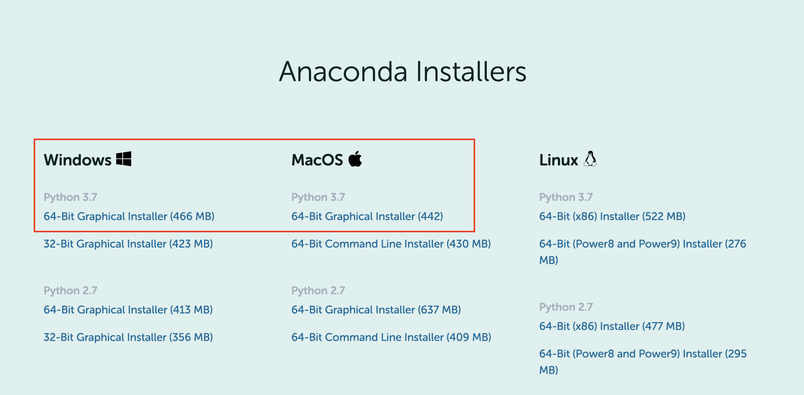

It may take a few minutes to downloand. Once downloaded, follow the instuctions to install to your PC or Mac.

After it's installed, you should be able to open up `Anaconca Navigator`.

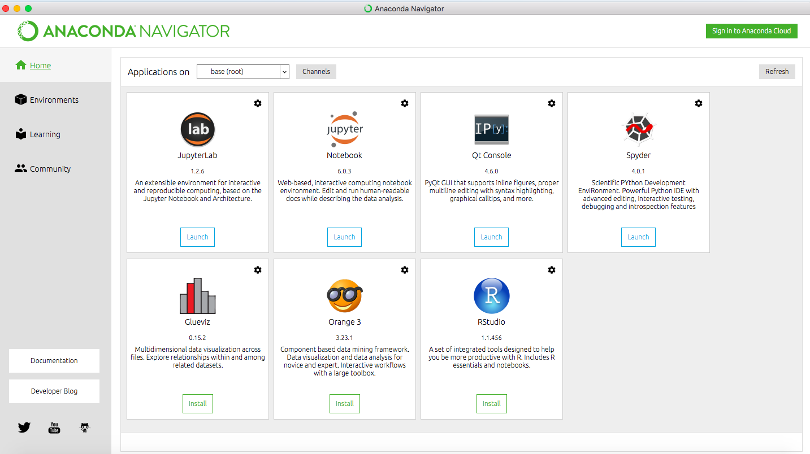

## Install Visual Studio Code

We are also going to install Visual Studio Code. Go to the link below and **downloand VSCode that meets your OS**.
https://code.visualstudio.com/download

Follow the instructions to install.

## Install Python Extension

Once installed, open Visual Studio Code. Then go to:

`View` -> `Extensions`

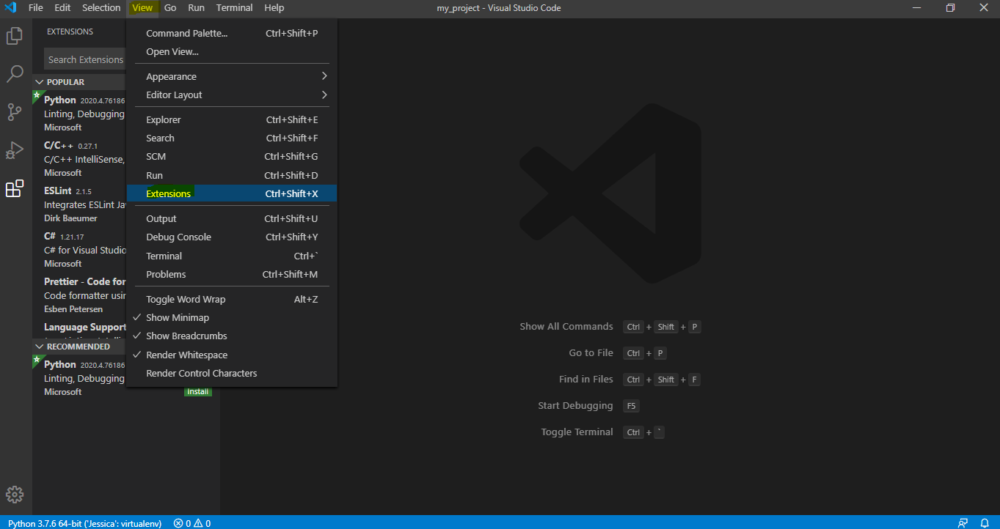

In the search bar, type "python"

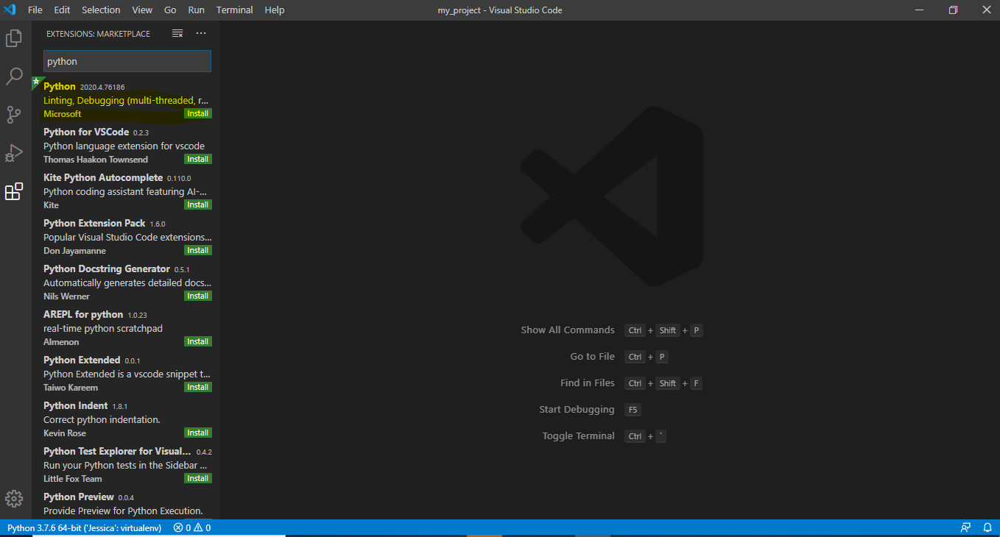

Select the one that says "Python" and click on "Install"
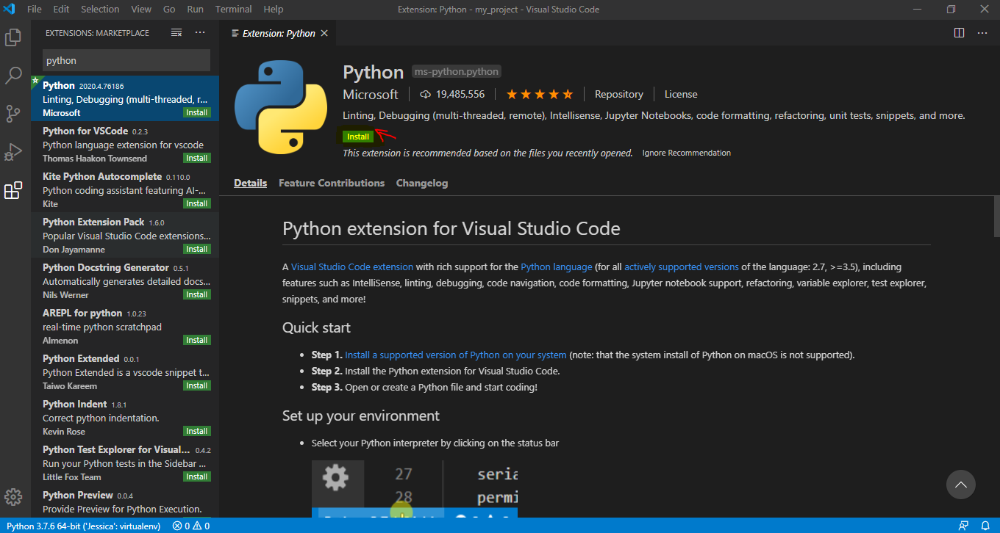

You should be all set for now!

### FAQ

#### Am I running 32-bit or 64-bit Windows?

Please refer to this link:
https://www.howtogeek.com/howto/21726/how-do-i-know-if-im-running-32-bit-or-64-bit-windows-answers/

#### Where do I find Anaconda-Navigator?

_Windows 7_

Type in "Anaconda" in search bar from Start button

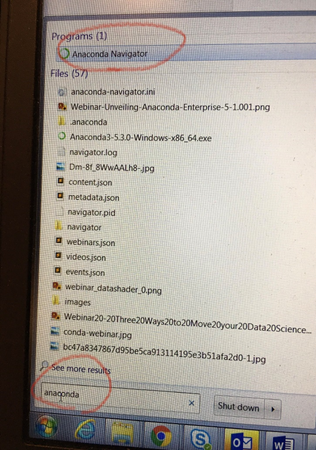

_Windows 10_

Type in “Anaconda” in Search box

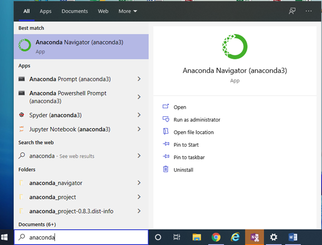

#### I still can't find Anaconda Navigator. What should I do?

If Anaconda Navigator is still not available, use https://jupyter.org/try

You will see a page like below:

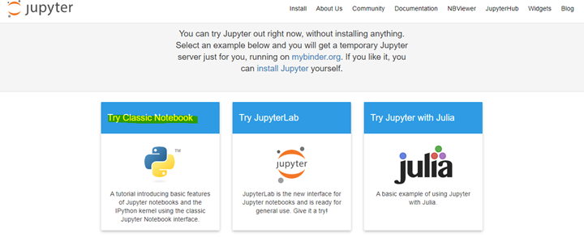

Click on "Try Classic Notebook".

Then you will see a page like this:
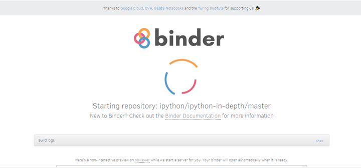

Wait for a few, and then you should see a page like below.

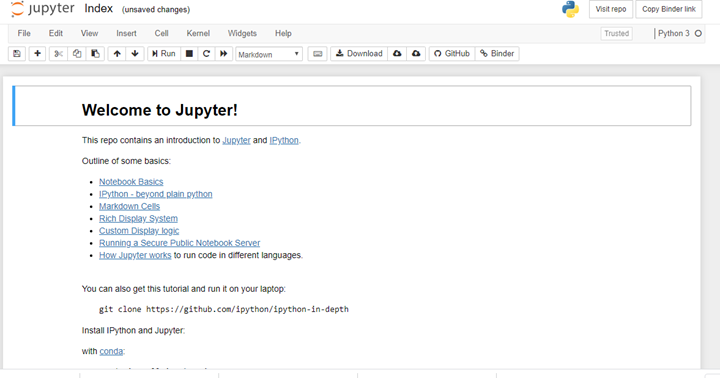

Click on the icon at the top left hand side that says "Jupyter".
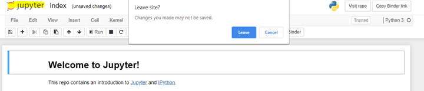

It should then bring you to this page.
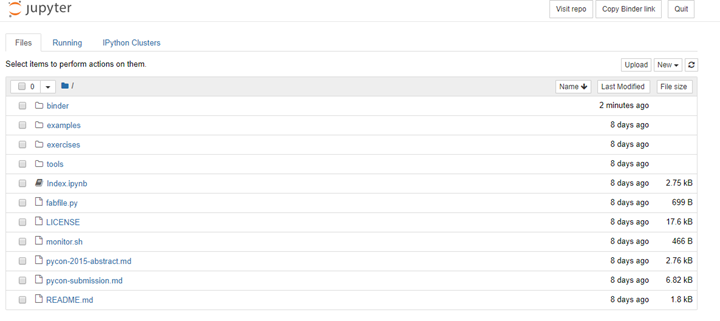

Now drag and drop the files into this page.
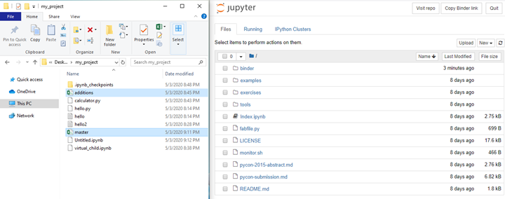

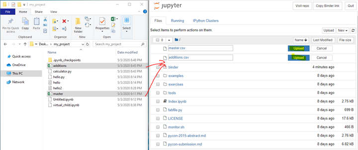

And then click on "Upload" for those two files. And you shoul be all set!

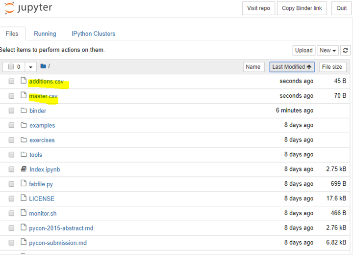
