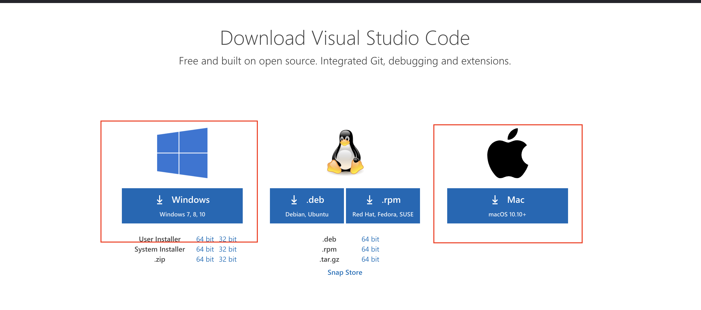

# Setup

## Install Anaconda

We will download Anaconda from this link:
https://www.anaconda.com/products/individual#windows

**Scroll all the way near to the bottom** to find the installer section and **select the one that meets your operating system**:

It may take a few minutes to downloand. Once downloaded, follow the instuctions to install to your PC or Mac.

After it's installed, you should be able to open up `Anaconca Navigator`.

## Install Visual Studio Code

We are also going to install Visual Studio Code. Go to the link below and **downloand VSCode that meets your OS**.
https://code.visualstudio.com/download

Follow the instructions to install.

## Install Python Extension

Once installed, open Visual Studio Code. Then go to:

`View` -> `Extension`

In the search bar, type "python"

Select the one that says "Python" and click on "Install"

You should be all set for now!
